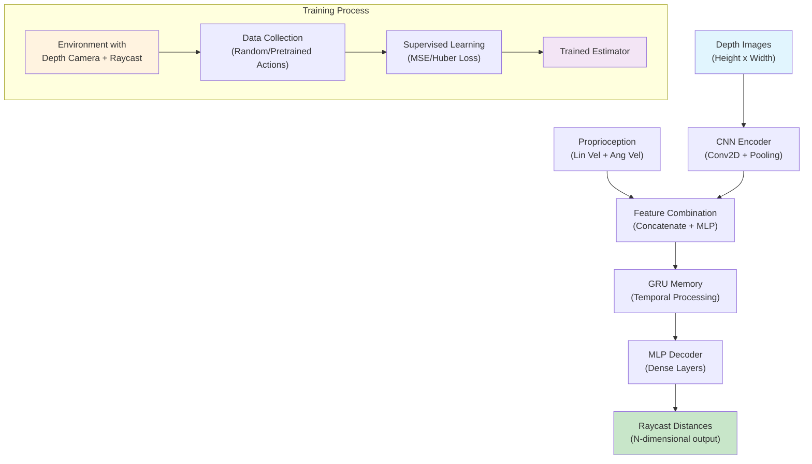

# Terrain Estimator Training

This document describes how to train and use the terrain estimator that predicts raycast distances from depth camera images and proprioceptive data.

## Quick Start Commands

### Environment Setup

```bash
conda activate diffuseloco
cd /path/to/legged_gym_project
```

### Basic Training

**AnymalC with Rough Terrain + Raycast:**

```bash
# Train terrain estimator (basic)
python legged_gym/scripts/terrain_est_train.py --task=anymal_c_rough_raycast --num_envs=4096 --headless

# Train with pretrained policy for better data collection
python legged_gym/scripts/terrain_est_train.py \
    --task=anymal_c_rough_raycast \
    --num_envs=4096 \
    --pretrained_policy=logs/anymal_c_rough/model_1000.pt \
    --experiment_name=terrain_est_anymal \
    --headless

# Resume training
python legged_gym/scripts/terrain_est_train.py \
    --task=anymal_c_rough_raycast \
    --resume \
    --load_run=-1 \
    --checkpoint=-1 \
    --headless
```

**ElSpider Air with Rough Terrain + Raycast:**

```bash
# Train terrain estimator
python legged_gym/scripts/terrain_est_train.py --task=elspider_air_rough_raycast --num_envs=6144 --headless

# Train with pretrained policy for better data collection
python legged_gym/scripts/terrain_est_train.py \
    --task=elspider_air_rough_raycast \
    --num_envs=4096 \
    --pretrained_policy=logs/rough_elspider_air/Aug01_15-44-20_/model_1900.pt \
    --experiment_name=terrain_est_elspider_air \
    --headless

# Train with custom hyperparameters
python legged_gym/scripts/terrain_est_train.py \
    --task=elspider_air_rough_raycast \
    --num_envs=4096 \
    --max_iterations=2000 \
    --learning_rate=1e-3 \
    --loss_type=huber \
    --num_learning_epochs=8 \
    --save_interval=50 \
    --headless

# Train with visualization enabled (shows ground truth vs predicted raycast points)
# Note: requires --headless=False to display visualization
python legged_gym/scripts/terrain_est_train.py \
    --task=elspider_air_rough_raycast \
    --num_envs=1024 \
    --enable_visualization \
    --visualization_interval=25 \
    --pretrained_policy=logs/rough_elspider_air/Aug01_15-44-20_/model_1900.pt
```

### Play and Visualization

**Basic Play Commands:**

```bash
python legged_gym/scripts/terrain_est_play.py \
    --task=elspider_air_rough_raycast \
    --load_run=-1 \
    --checkpoint=-1 \
    --pretrained_policy=logs/rough_elspider_air/Aug01_15-44-20_/model_1900.pt \
    --num_episodes=10
```


### Training Tips

1. **Start with pretrained policy**: Use a well-trained locomotion policy for data collection to get diverse, realistic robot behaviors
2. **Monitor loss convergence**: Terrain estimation loss should decrease steadily over iterations
3. **Check data quality**: Ensure both depth camera and raycast are working correctly in your environment
4. **Tune hyperparameters**: Try different loss functions (MSE, Huber, L1) based on your data characteristics

### Testing and Evaluation

```bash
# Test trained estimator (create evaluation script)
python legged_gym/scripts/terrain_est_eval.py \
    --task=anymal_c_rough_raycast \
    --num_envs=100 \
    --checkpoint=logs/terrain_est_anymal/estimator_1000.pt

# Compare estimator predictions with ground truth raycast
python legged_gym/scripts/terrain_est_compare.py \
    --task=elspider_air_rough_raycast \
    --estimator_path=logs/terrain_est_elspider/estimator_2000.pt \
    --num_test_steps=1000
```

**Note**: Evaluation scripts are not implemented yet but can be created following the same patterns as the training script.

---

## Overview

The terrain estimator is a neural network that learns to predict raycast terrain measurements using only depth camera images and robot proprioception (base velocities). This enables terrain-aware navigation without requiring expensive raycast computations during deployment.

## Architecture



The terrain estimator consists of three main components:

1. **CNN Encoder**: Processes depth images to extract spatial features
2. **GRU Memory**: Provides temporal processing for sequence-aware predictions  
3. **MLP Decoder**: Converts processed features to raycast distance predictions

### Input and Output

- **Input**: 
  - Depth images (Height × Width)
  - Proprioceptive data (6D: linear velocity + angular velocity)
- **Output**: 
  - Raycast distances (N-dimensional vector matching environment raycast configuration)

## Configuration

### Training Configuration

Create a training configuration dictionary with the following structure:

```python
train_cfg = {
    "runner": {
        "num_steps_per_env": 24,
        "save_interval": 100,
        "logger": "tensorboard"
    },
    "algorithm": {
        "num_learning_epochs": 5,
        "gradient_length": 15,
        "learning_rate": 1e-3,
        "max_grad_norm": 1.0,
        "loss_type": "mse"  # or "huber", "l1"
    },
    "estimator": {
        "encoder_output_dim": 64,
        "memory_hidden_size": 256,
        "memory_num_layers": 1,
        "memory_type": "gru",
        "decoder_hidden_dims": [128, 64],
        "activation": "elu"
    }
}
```

### Environment Configuration

Ensure your environment configuration includes both depth camera and raycast settings:

```python
# Depth camera configuration
env_cfg.depth.use_camera = True
env_cfg.depth.update_interval = 1  # Update every physics step
env_cfg.depth.buffer_len = 1       # Single frame
env_cfg.depth.resolution = [58, 87] # Camera resolution

# Raycast configuration
env_cfg.raycaster.enable_raycast = True
env_cfg.raycaster.ray_pattern = "cone"  # or "spherical", "grid"
env_cfg.raycaster.num_rays = 32
env_cfg.raycaster.ray_angle = 1.0
env_cfg.raycaster.max_distance = 10.0
```


## Usage

### Command Line Training

The terrain estimator can be trained using the dedicated training script:

```bash
# Basic training command
python legged_gym/scripts/terrain_est_train.py --task=anymal_c_rough_raycast --num_envs=4096 --headless

# Training with custom parameters
python legged_gym/scripts/terrain_est_train.py \
    --task=elspider_air_rough_raycast \
    --num_envs=6144 \
    --max_iterations=2000 \
    --learning_rate=1e-3 \
    --loss_type=huber \
    --num_learning_epochs=8 \
    --headless

# Resume training from checkpoint
python legged_gym/scripts/terrain_est_train.py \
    --task=anymal_c_rough_raycast \
    --num_envs=4096 \
    --resume \
    --load_run=-1 \
    --checkpoint=-1 \
    --headless

# Training with pretrained policy for better data collection
python legged_gym/scripts/terrain_est_train.py \
    --task=anymal_c_rough_raycast \
    --num_envs=4096 \
    --pretrained_policy=logs/rough_terrain_walker/model_1000.pt \
    --experiment_name=terrain_est_with_policy \
    --headless
```

### Command Line Arguments

| Argument | Type | Default | Description |
|----------|------|---------|-------------|
| `--task` | str | `anymal_c_rough_raycast` | Environment task with depth+raycast support |
| `--num_envs` | int | 4096 | Number of parallel environments |
| `--max_iterations` | int | 1000 | Maximum training iterations |
| `--learning_rate` | float | 1e-3 | Learning rate for estimator |
| `--loss_type` | str | `mse` | Loss function (`mse`, `huber`, `l1`) |
| `--num_learning_epochs` | int | 5 | Learning epochs per iteration |
| `--num_steps_per_env` | int | 24 | Steps per environment per iteration |
| `--save_interval` | int | 100 | Save model every N iterations |
| `--pretrained_policy` | str | None | Path to pretrained policy for data collection |
| `--resume` | flag | False | Resume from checkpoint |
| `--headless` | flag | False | Run without GUI |
| `--enable_visualization` | flag | False | Enable visualization of predictions vs ground truth |
| `--visualization_interval` | int | 50 | Visualize every N iterations |

### Programmatic Training

```python
import torch
from rsl_rl.runners import TerrainEstimatorRunner
from legged_gym.envs import LeggedRobotDepth

# Create environment with depth camera and raycast
env = LeggedRobotDepth(cfg=env_cfg, ...)

# Create runner
runner = TerrainEstimatorRunner(
    env=env,
    train_cfg=train_cfg,
    pretrained_policy_path="path/to/pretrained_policy.pt",  # Optional
    log_dir="logs/terrain_estimator",
    device="cuda:0"
)

# Train the estimator
runner.learn(num_learning_iterations=1000)
```

### Inference

```python
# Load trained estimator
runner.load("logs/terrain_estimator/estimator_1000.pt")
estimator = runner.get_inference_estimator(device="cuda:0")

# Use estimator for prediction
depth_image = ...  # [batch_size, height, width]
proprio_data = ... # [batch_size, 6] (lin_vel + ang_vel)

with torch.no_grad():
    estimated_raycast = estimator.act_inference(depth_image, proprio_data)
    # estimated_raycast: [batch_size, num_raycast_outputs]
```

## Key Features

### Adaptive Architecture
- **CNN Encoder**: Uses adaptive pooling to handle different input resolutions
- **Memory Module**: GRU provides temporal context for better predictions
- **Flexible Decoder**: Configurable hidden layers and activation functions

### Training Process
1. **Data Collection**: Environment runs with random/pretrained actions while collecting depth images and raycast ground truth
2. **Supervised Learning**: Estimator learns to predict raycast distances using regression loss
3. **Temporal Processing**: GRU memory enables learning from sequence history

### Loss Functions
- **MSE**: Standard mean squared error for smooth gradients
- **Huber**: Robust to outliers, good for noisy data
- **L1**: Sparse gradients, robust to large errors

## File Structure

```
rsl_rl/
├── modules/
│   └── terrain_estimator.py          # TerrainEstimator neural network
├── algorithms/
│   └── distillation.py              # EstimatorDistillation algorithm
└── runners/
    └── terrain_estimator_runner.py  # Training runner

legged_gym/
├── envs/base/
│   ├── legged_robot_raycast.py      # Base class with raycast support
│   └── legged_robot_depthcam.py     # Depth camera integration
└── doc/
    └── terrain_estimator.md         # This documentation
```

## Tips and Best Practices

### Training Tips
1. **Data Quality**: Ensure both depth camera and raycast are working correctly
2. **Action Diversity**: Use varied actions (random or pretrained policy) for diverse terrain exposure
3. **Loss Monitoring**: Watch estimation loss convergence
4. **Hyperparameter Tuning**: Adjust learning rate and network size based on data complexity

### Common Issues
1. **Memory Issues**: Reduce batch size or sequence length if GPU memory is limited
2. **Poor Convergence**: Try different loss functions (Huber is often more stable than MSE)
3. **Overfitting**: Add regularization or reduce model capacity
4. **Data Mismatch**: Verify depth and raycast data are temporally aligned

### Performance Optimization
- Use mixed precision training for faster convergence
- Enable distributed training for multi-GPU setups
- Consider depth image preprocessing (normalization, augmentation)

